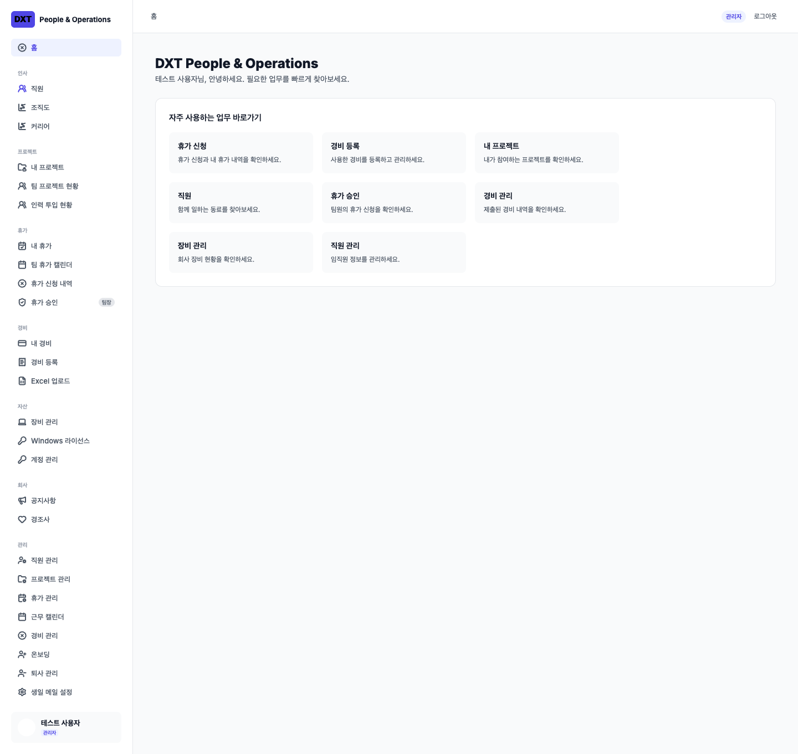
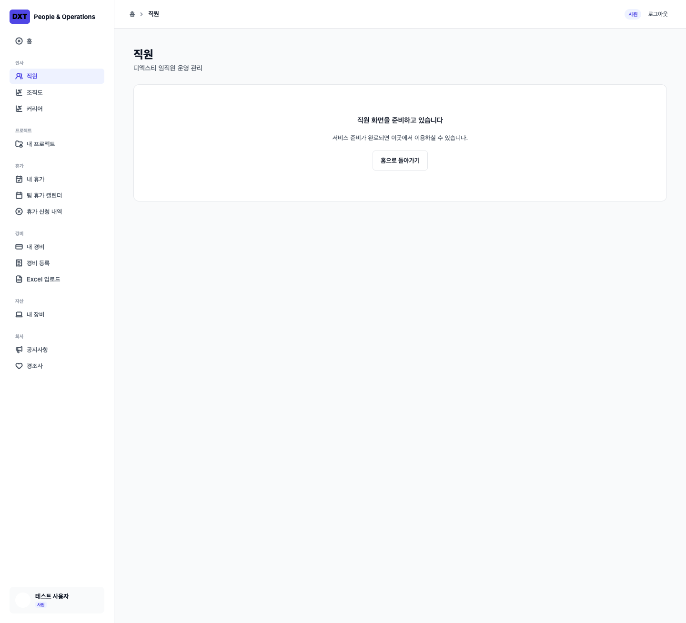
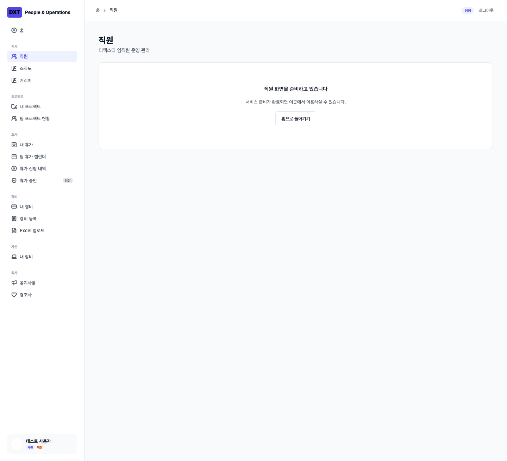
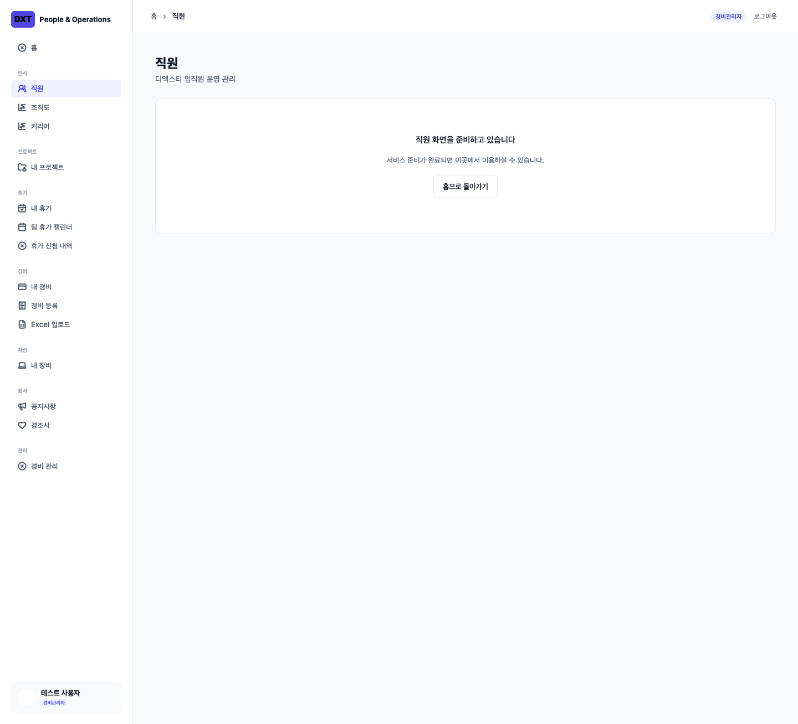
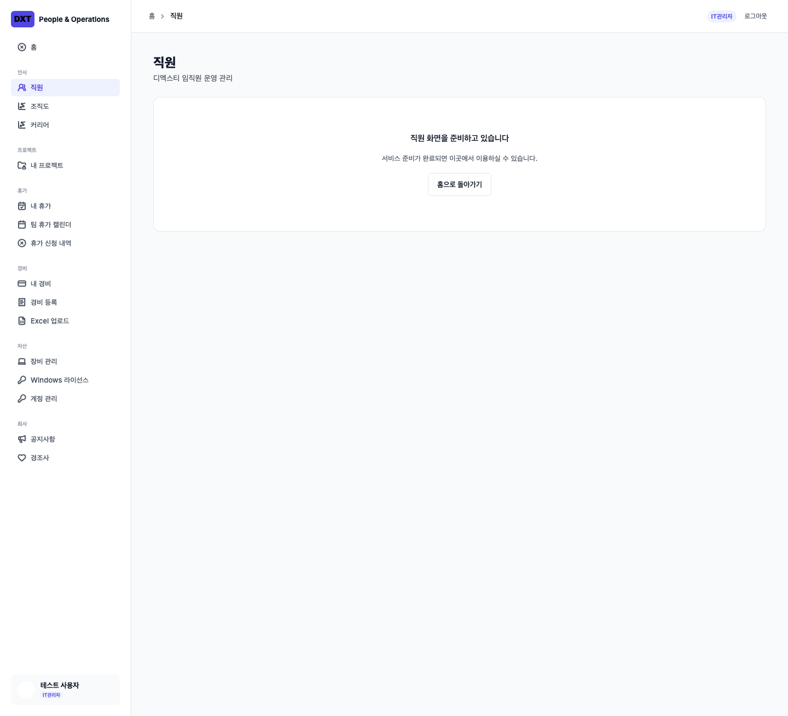
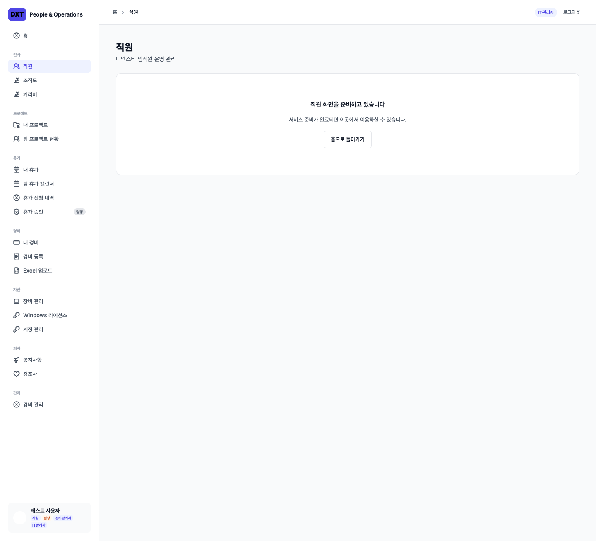
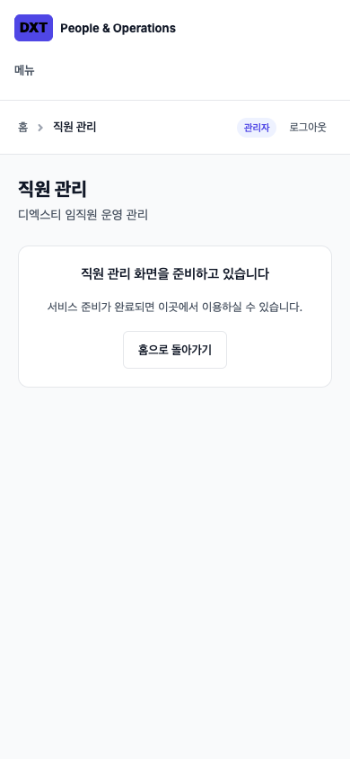
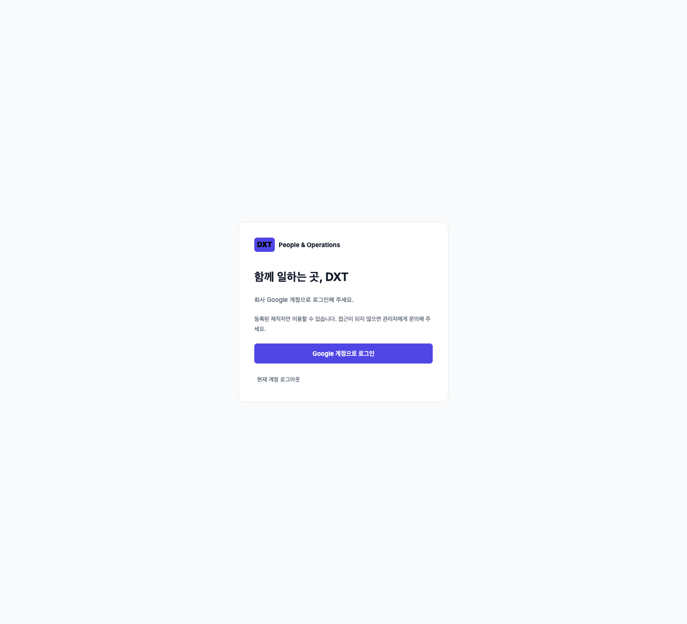

# Phase 1 — Foundation, Auth, Roles, App Shell

Implements Issue #1. Read before implementation: AGENTS.md, PRODUCT_SPEC, BUSINESS_RULES, PERMISSIONS, DATA_MODEL, ROUTES, UI_IMPLEMENTATION, and README.

## Delivered boundary

Next.js App Router, TypeScript, Supabase Google OAuth/PKCE sign-in and logout, protected membership lookup, additive role/capability evaluation, Korean DXT app shell, role-aware shortcuts, responsive navigation, and server checks for every route in ROUTES.md. Domain modules intentionally render preparation states: Phase 1 does not claim to implement employees, leave, expenses, or other later-phase business workflows.

`src/lib/routes.ts` is the shared route/navigation registry. Exact and bounded dynamic matches prevent a private descendant from inheriting its parent's less-restrictive permission. The page calls `requireCapability` before constructing the shell. Unknown or unauthorized routes render the generic not-found response. Unauthenticated, unprovisioned, or inactive users return to login. RSC streaming uses Next's not-found error digest (the transport may be HTTP 200); protected page content is never included.

The proxy refreshes Supabase cookies; it is not the authorization boundary. `currentPrincipal` validates the user with Supabase Auth `getUser`, then reads membership with the user's RLS-scoped client. React request caching does not persist authorization across requests. Neither client cookies' user objects nor `user_metadata` supply roles. Future data loaders, server actions, and APIs must independently call the capability guard and enforce own/team/global row scope; a page guard alone is insufficient for future domain data.

## Schema and permission decisions

One table: `app_memberships`, keyed by `auth.users.id`, with display name, ACTIVE/INACTIVE status, roles, and explicit sensitive capabilities. This is an access record, not the Phase 2 employee model. It stores no HR-private fields or credentials. RLS permits only own-row SELECT; authenticated and anonymous clients cannot write memberships. Role names, grant names, eligibility, nonempty role sets, and one designated private-HR ADMIN are enforced in PostgreSQL.

- All seven recognized roles receive employee base capabilities; multiple roles form a union.
- TEAM_LEADER adds team projects and leave approval/reason access, without team expenses.
- EXPENSE_ADMIN adds expense management only; IT_ADMIN adds asset, Windows, and account management plus the documented secret-reveal capabilities.
- ADMIN/CEO receive broad operational access; CEO alone receives resignation-reason capability.
- Issue #1 explicitly says no automatic private-HR inheritance. Consequently **CEO and the designated ADMIN both need an explicit `PRIVATE_HR_ACCESS` grant**. The database rejects a second non-CEO private-HR administrator.
- ADMIN/CEO do not receive Windows/password reveal from their roles; an explicit grant or additive IT_ADMIN role is required.
- DIVISION_HEAD remains employee-only pending the policy in PERMISSIONS.md. No broader access is inferred.
- IT/admin asset management replaces the personal asset navigation item while preserving access to `/assets/me`.
- Private HR appears only as an authorized employee-detail link, never as a disabled/locked item.

## Figma comparison

Sources inspected with design context and screenshots:
- [01 Application Shell, node 15:7](https://www.figma.com/design/BL670ZpeySoSAhEZLgK62e/DXT-HR_AI?node-id=15-7)
- [13 Role-Based Sidebars, node 29:22](https://www.figma.com/design/BL670ZpeySoSAhEZLgK62e/DXT-HR_AI?node-id=29-22)

Preserved: 240px white sidebar, 20px sidebar padding, 60px header, 40px desktop content padding, Inter typography with Korean system fallback, 13px menu text, 16px navigation icons, compact section labels, #4F46E5/#EEF2FF active states, white/light-gray surfaces, 12px content-card corners, and role tags. Original 24 SVG exports are local and unmodified, retaining their root dimensions. Browser checks verify nonempty images and intrinsic/rendered dimensions.

Intentional product adaptations: the Figma shell's design-index cards become working, permission-filtered shortcuts; fixture identity replaces the designer's example name. The written route/permission spec adds work-calendar and birthday-settings destinations, preserves own projects additively, and avoids duplicate links to the same management page. Logout is available in the header. No global search or notification bell is introduced. Domain forms/tables remain outside Phase 1.

Screenshots use synthetic identity only:

## Verification and remaining integration

Unit tests cover all 128 role combinations, specialist isolation, explicit grants, invalid memberships, route matching, and safe redirects. PGlite runs the actual SQL migration and verifies RLS, denied writes, invalid roles/grants, and the single-admin constraint. Playwright tests the production build with a separate local Auth/PostgREST double, including direct URLs, forged metadata, unknown routes, RSC errors, private-HR eligibility, role-specific navigation, the Google OAuth/PKCE callback and return path, logout, image geometry, and mobile overflow.

The repository contains no Supabase project credentials. Applying the migration and a real Google/Supabase sign-in remain deployment setup checks; the local test double does not prove external provider configuration. No live database was changed. Phase 2 must add employee/domain schemas and own/team/global data policies before exposing business data. Broader division-head permissions remain unresolved as specified.

Auth implementation references: [Next.js authentication guide](https://nextjs.org/docs/app/guides/authentication) and [Supabase SSR client guide](https://supabase.com/docs/guides/auth/server-side/creating-a-client?framework=nextjs).
